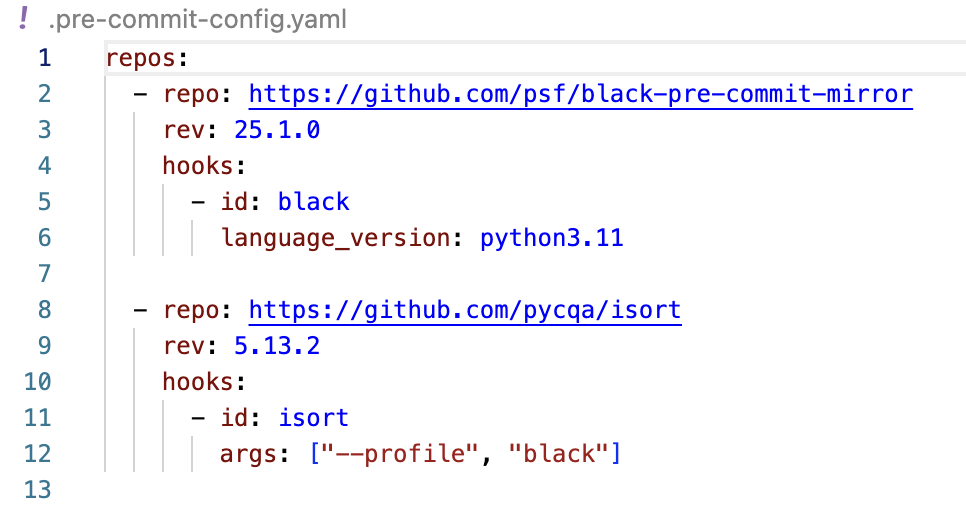

# Backend API

This repository contains a FastAPI backend application for BP&Co services.

## Prerequisites

### Python environment

Python version : 3.11.12

Create your local environment for this repo

```bash
python3.11 -m venv .venv
```

Activate it (bash/zsh)

```bash
source venv/bin/activate
```

Install requirements

```bash
python -m pip install -r requirements.txt
```

### Formating

Make sure to install and activate the extensions

- black formatter
- isort

Note that you should make sure to have the same args in your isort and black formatter settings as in the `pre-commit-config.yaml` file



Then, once venv is activated, make sure to install pre-commit with

```bash
pre-commit install
```

And voilà. Now everytime you try to commit it will reformat the files if you are not respecting the formatting of blackformatter and isort. But as you have the extensions on, everything should be fine.

### Docker

Before running the application, you need to have Docker Desktop installed:

1. Download Docker Desktop from [https://www.docker.com/products/docker-desktop/](https://www.docker.com/products/docker-desktop/)
2. Install Docker Desktop following the installation instructions for your operating system
3. Start Docker Desktop and ensure it's running

---

Copy paste `.env-example` to `.env` and fill it with your own environment requirements.

## Reset the database

To reset the database, use the following command:

```bash
/bin/bash bash/reset-db.sh
```

## Running the Application

To run the application, use the following command:

```bash
docker-compose up -d
```

To stop the application, use the following command:

```bash
docker-compose down
```

The API will be available at:

- API: http://localhost:${APP_PORT}
- API Documentation: http://localhost:${APP_PORT}/docs
- Alternative API Documentation: http://localhost:${APP_PORT}/redoc
